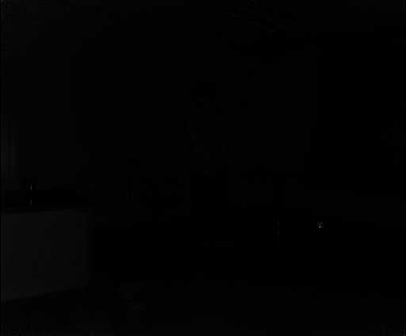
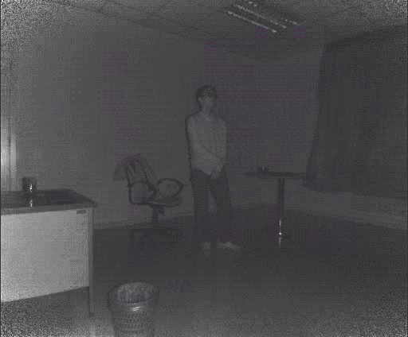
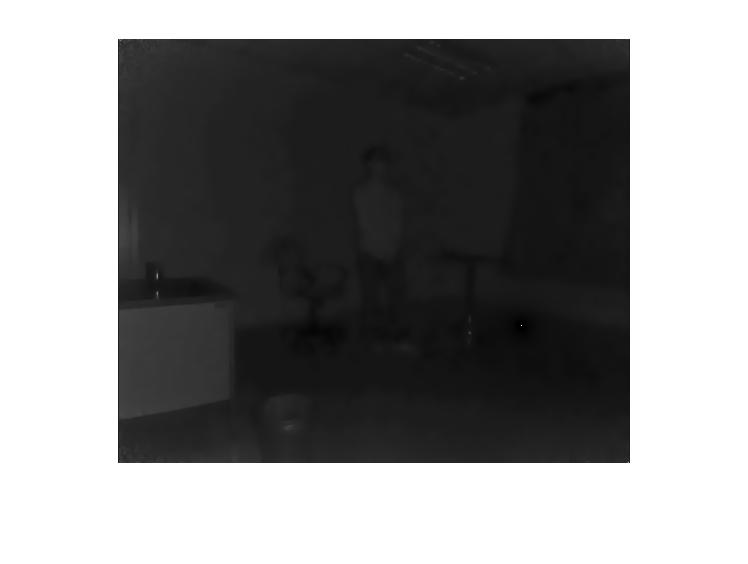

# Low Light Enhancement Trial

Use image processing method to enhance IR frames quality, reference paper: Structure-Revealing Low-Light Image Enhancement via Robust Retinex Model. TIP, 2018. PKU & Microsoft.

## Pipeline

1. Sample frame from video using Python and OpenCV VideoCapture (first frame in this trial)
2. Process it with naive Python method, multiply and add a number, save original frame and python-processed frame as comparisons
3. Use Matlab script to enhance image quality, and save it
4. Tune some parameter and save results

## Result

**Original Frame**

**Python-processed Frame**

**Matlab-processed Frame**

## Trial Conclusion

Matlab script cannot enhance image quality as our expectation, not to mention Matlab reading videos, deployment on Linux servers and performance.